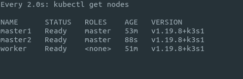

# Ceph
## Prerequisites
- each node should have a raw disk(without a filesystem and not mounted)
- use this [script](https://github.com/threefoldtech/tf-images/blob/master/k3s/dev_guide/README.md) to install the kubernetes env
## preparing environment
ssh to any of the nodes for example master node
```bash
ssh root@172.17.0.100
```
make sure you have all of your three nodes in Ready state
```bash
kubectl get nodes
```


## Installation
### Install Ceph operator
```bash
helm repo add rook-release https://charts.rook.io/release
kubectl create namespace rook-ceph
helm install --namespace rook-ceph rook-ceph rook-release/rook-ceph
```
make sure all pods are working
```bash
kubectl get pods -A
```


### Install Ceph cluster
```bash
helm repo add rook-master https://charts.rook.io/master
helm install --create-namespace --namespace rook-ceph rook-ceph-cluster \
    --set operatorNamespace=rook-ceph rook-master/rook-ceph-cluster
```
## Creating Storage pool and Storage class
```yaml
apiVersion: ceph.rook.io/v1
kind: CephBlockPool
metadata:
  name: replicapool
  namespace: rook-ceph
spec:
  failureDomain: host
  replicated:
    size: 3
    requireSafeReplicaSize: true
    # gives a hint (%) to Ceph in terms of expected consumption of the total cluster capacity of a given pool
    # for more info: https://docs.ceph.com/docs/master/rados/operations/placement-groups/#specifying-expected-pool-size
    #targetSizeRatio: .5
---
apiVersion: storage.k8s.io/v1
kind: StorageClass
metadata:
  name: rook-ceph-block
provisioner: rook-ceph.rbd.csi.ceph.com
parameters:
  clusterID: rook-ceph
  pool: replicapool
  imageFormat: "2"
  imageFeatures: layering
  csi.storage.k8s.io/provisioner-secret-name: rook-csi-rbd-provisioner
  csi.storage.k8s.io/provisioner-secret-namespace: rook-ceph # namespace:cluster
  csi.storage.k8s.io/controller-expand-secret-name: rook-csi-rbd-provisioner
  csi.storage.k8s.io/controller-expand-secret-namespace: rook-ceph # namespace:cluster
  csi.storage.k8s.io/node-stage-secret-name: rook-csi-rbd-node
  csi.storage.k8s.io/node-stage-secret-namespace: rook-ceph
  csi.storage.k8s.io/fstype: ext4
allowVolumeExpansion: true
reclaimPolicy: Retain
```
## Create Volume Claim
```yaml
apiVersion: v1
kind: PersistentVolumeClaim
metadata:
  name: test-vol
spec:
  accessModes:
    - ReadWriteOnce
  resources:
    requests:
      storage: 2Gi
  storageClassName: rook-ceph-block
```
## How to use in pods/deployments
```yaml
volumes:
- name: bin
  persistentVolumeClaim:
    claimName: test-vol
```
## Notes
- This will attach the volumes to your pods and in case of failure of any pod after pod redeployment it will use the same volume regardless pod location on the nodes
- In case of deployment deleted for some reason and you want to recover the pvs you can apply this patch to the pvs to make them available again with your data on them
```bash
kubectl patch pv $PV_NAME --type json -p '[{"op": "remove", "path": "/spec/claimRef/uid"}]'
```
