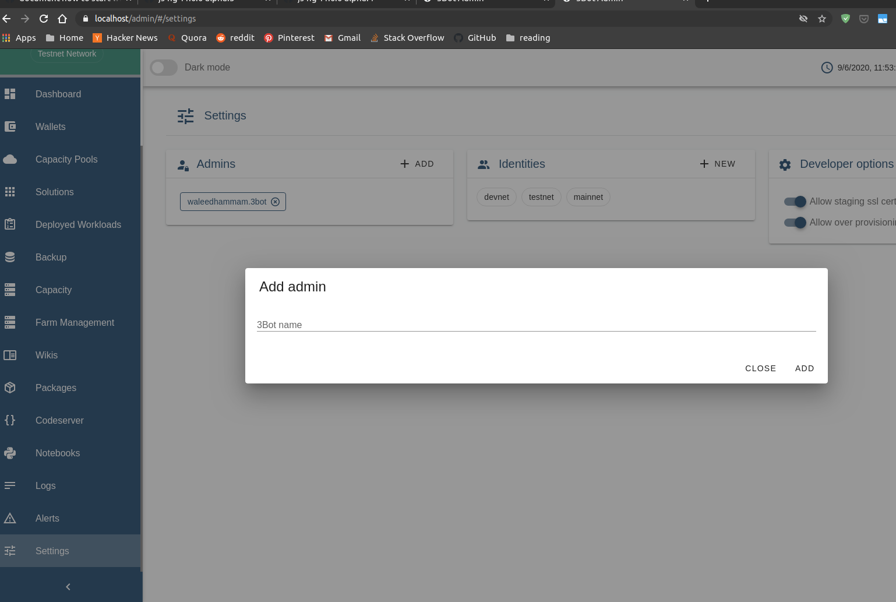

# Identity

Identity contains information that identify the user to other threebot machines.
Multiple identities can be configured. By default if only one is configured it will be used as default `me`.

## configuring identity

To configure your identity:

```python
me = j.core.identity.new(name="default", tname="3BOT_NAME", email="3BOT_EMAIL", words="3BOT_WORDS", explorer_url="EXPLORER_URL")
```

Parameters:

- name: Instance name which be used to deal with that identity in local configurations also in the admin dashboard (Should be unique on the system)
- tname: The 3Bot name you want to register your identity with in the explorer. (Should be unique)
- email: The 3Bot email you want to register your identity with in the explorer.
- words: The secret words you want to to register your identity with in the explorer.

  > Note: you can generate new words with `words = j.data.encryption.generate_mnemonic()`

- explorer_url: The explorer url for the explorer you want to use:
  - Testnet: `https://explorer.testnet.grid.tf/api/v1/`
  - Mainnet: `https://explorer.grid.tf/explorer/`
  - Devnet: `https://explorer.devnet.grid.tf/api/v1/`

It's really recommended to use tname, email, words from ThreeFold Connect application .

## To register your identity in TFGrid

```python
me.register()
me.save()
```

## To access his threebot id

```python
me.tid
# or
j.core.identity.me.tid
```

To change the default `me`

```python
j.core.identity.set_default("othername")
```

The tool gets the id as follows:

- If user already registered on the same machine will get directly from config
- If is a new registration will contact the explorer to gets the user information and verifies it against local config and set the id
- If a new user will create the user and register it on the explorer and continue like the preceding point

## Adding admins to the 3Bot

- The identity manager allows you to add admins to your 3Bot with that you can give access to admin dashboard or admin required endpoints to these admins

- How to add admins

  - Through shell:

    ```python
    j.core.identity.me.admins.append("NEW_ADMIN_3Bot_NAME") # example: hamada.3bot
    j.core.identity.me.save()
    ```

  - Through admin panel:
    - Go to `Settings` tab, then add admin

      

## Encryption

`nacl` property wrapes some signing/encrypting functionalities using the user private key which is generated from his seed words.

The user private key can be accessed from the identity:

```python
j.core.identity.me.nacl.private_key
<nacl.public.PrivateKey at 0x7f2749f4e510>
```

Same with the signing key:

```python
j.core.identity.me.nacl.signing_key
<nacl.signing.SigningKey at 0x7f2760aecf10>
```
