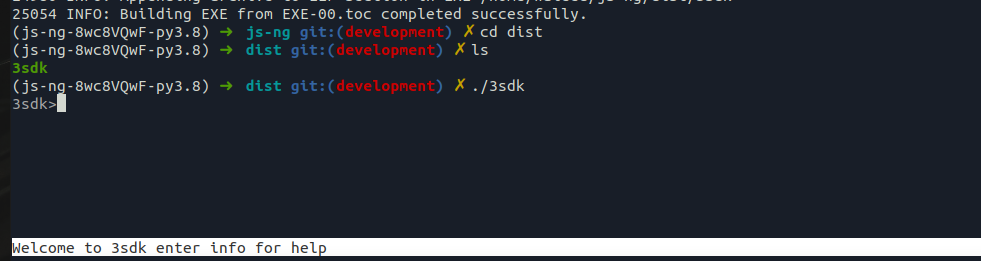
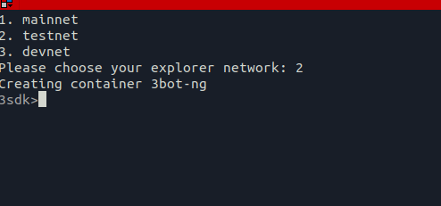
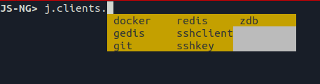
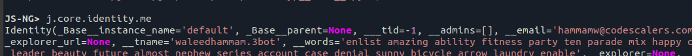

# Quick Start with js-ng

## Requirments

- Ubuntu 18.04 or later
- Docker installed check [here](https://docs.docker.com/engine/install/ubuntu/)
- git, python3, python3-pip, pyinstaller

  ```bash
  sudo apt-get install -y git python3 python3-pip python3-venv;
  pip3 install poetry pyinstaller;
  ```

## Getting started with 3sdk [Build your binary]

- Clone the jsng repository and prepare the virtual environment

  ```bash
  mkdir -p ~/sandbox/code/threefoldtech/;
  cd ~/sandbox/code/threefoldtech/;
  git clone https://github.com/threefoldtech/js-ng.git;
  cd js-ng;
  poetry update;
  poetry install;
  poetry shell;
  ```

- Build the sdk binary [here](https://github.com/threefoldtech/js-ng/blob/development/docs/wiki/3sdk.md#building-the-3sdk)

- Once pyinstaller finishes and the binary ready under the `{js-ng_repository_path}/dist` we can run it using

  ```bash
  cd ~/sandbox/code/threefoldtech/js-ng/dist/;
  ./3sdk;
  ```

  

## Spawn a threebot container

- Install threebot using `threebot install` like [here](https://github.com/threefoldtech/js-ng/blob/development/docs/wiki/3sdk.md#using-3sdk)

- After it's done you will see something like that

  

- Now exit the shell, and get into the container with

  ```bash
  docker exec -it 3bot-ng bash
  ```

- To start js shell just type

  ```bash
  jsng
  ```

  

  You are now ready to go with your threebot container

- To make sure the identity is configured correctly

  ```bash
  j.core.identity.me
  ```

  you will find your information there.
  

## To start the threebot server

- From `jsng` shell just make:

  ```python
  server = j.server.threebot.get("default")
  server.start()
  ```

- Then access the admin panel via: http://container-ip/

*usually container ip is 172.17.0.2

*on mac you'll need a wireguard to your container to access the container

## Create a reservation via jsng Shell

See [here](https://github.com/threefoldtech/js-sdk/blob/30fbc245e22030e5b3fc1a393a9ae2a838d78c22/docs/wiki/tutorials/deploy_ubuntu_container.md)
