# Quick Start with js-sdk

## Requirments for insystem installation

- Ubuntu 18.04 or later, MacOS 10.9 or more
- packages [python3, python3-pip, git, poetry, nginx, redis]

- Install packages on Ubuntu

  These are for certbot:
  ```bash
  apt-get install -y software-properties-common;
  add-apt-repository universe;
  add-apt-repository ppa:certbot/certbot;
  ```

  Then:
  ```bash
  apt-get update
  apt-get install -y git python3-venv python3-pip redis-server tmux;
  apt-get install -y nginx certbot python-certbot-nginx;
  pip3 install poetry
  ```

- Install packages on MacOS
  - nginx [here](https://www.javatpoint.com/installing-nginx-on-mac)
  - certbot `brew install certbot`
  - redis-server [here](https://medium.com/@petehouston/install-and-config-redis-on-mac-os-x-via-homebrew-eb8df9a4f298)
  - git from [here](https://www.atlassian.com/git/tutorials/install-git)
  - python3 [here](https://docs.python-guide.org/starting/install3/osx/)
  - tmux `brew install tmux`

## Installation in system (Experts)
(note: for mac OSX use root user during installation to be able to use ports (80, 443) `sudo su -`)
- Clone the repository `git clone https://github.com/threefoldtech/js-sdk`
- Install the js-ng

  ```bash
  cd js-sdk
  poetry update
  poetry install
  poetry shell
  ```


- Make sure to setcap for nginx (for linux only)
```
sudo setcap cap_net_bind_service=+ep `which nginx`
```
to be able to run as a normal user, you don't need it if you are root.

- After that we will just do

  ```bash
  threebot start
  ```

- This will take you to configure your identity, It will ask you about your the network you want to use, 3bot name, email, and words.

- Then it will start threebot server you will see some thing like that

  

- After success you can visit the admin dashboard at http://localhost and start creating reservations

  

## Create a reservation via jsng Shell (without admin panel)

See [here](https://github.com/threefoldtech/js-sdk/blob/30fbc245e22030e5b3fc1a393a9ae2a838d78c22/docs/wiki/tutorials/deploy_ubuntu_container.md)

## Access admin panel

Now the admin panel should available on the host and can be accesse through `<HOST>/admin` where you will be redirected to 3bot login. The admin panel ha many functionalities but our main usage in this tutorial will be to deploy an ubuntu container using its chatflow.

## Create a new wallet

There are two options to be create a wallet, first is using the jsng shell where you will setup the wallet and can get FreeTFTs and TFTs. Second is through the admin dashboard where you will not be able to set up and recieve FreeTFTs and test TFTs.

1. Using jsng shell:

    See [here](https://github.com/threefoldtech/js-sdk/blob/development/docs/wiki/tutorials/add_funds_to_wallet.md)

2. Using admin panel:
    First we need to setup the payment method wich is the wallet we will use to pay for the deployment machine. This can be done through the admin under `Wallet manager`.

    

    One of the following can be done:

    - **Create a new wallet**: You can create a new wallet by clicking on the `create wallet` button then entering the name of the wallet to be created. Make sure you save the secret of the wallet created to be able get the wallet incase it was lost. Transfer the amount of tokens you need to your wallet to have enough funds for the deployment.
    

    - **Import an existing wallet**:If you already have a stellar wallet then you can simply import it by clicking on `import wallet` then entering the wallet name and secret.
    

Now that the wallet is setup, you are ready for your first deployment.

## Deploy your private overlay network
Before we get to deploy the actual Ubuntu container, we first need to create a private overlay network.

The technology used to implement the network overlay is [Wireguard](https://www.Wireguard.com/). Make sure you have installed Wireguard on your device to able to continue: [Wireguard installation](https://www.wireguard.com/install/)

For this tutorial we will use the network wizard that will guide us through the creation of your network.

To start the wizard click the left menu on Solutions then Network then Create new


First step is to choose the name of your network. This name is only used to identify the network later on when deploying workloads.

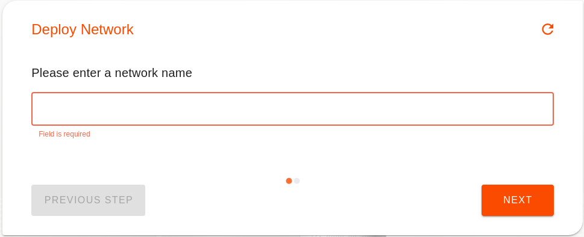

Then choose the currency that will be used for paying for all the deployments on your network

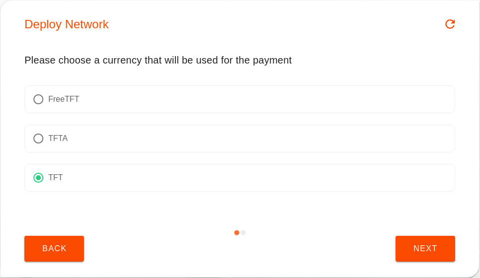

The next step is to choose the expiration time of your reservation. Each capacity reservation made on the grid is always bound to an expiration date. Once the date is reached, the capacity is released back to the grid and your workloads deleted.

For this tutorial one day will be more than enough.

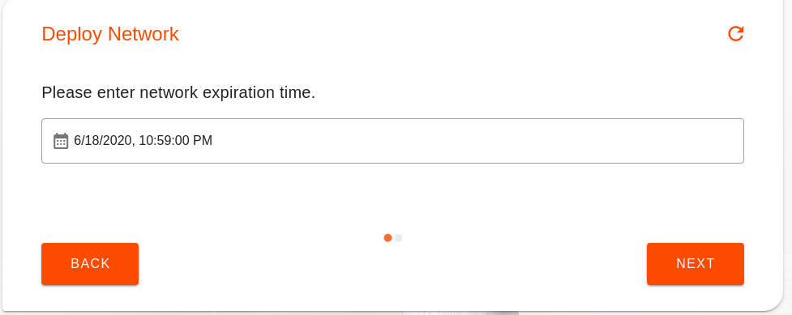

The nodes running on the TFGrid all communicate over IPv6. While this is very convenient for the nodes, not everyone has access to IPv6 already. For this reason we allow people to configure `entrypoint` using IPv4 address.

This step lets you choose between IPv6 or IPv4 for your `entrypoint`. If you are not sure what to choose, pick IPv4.

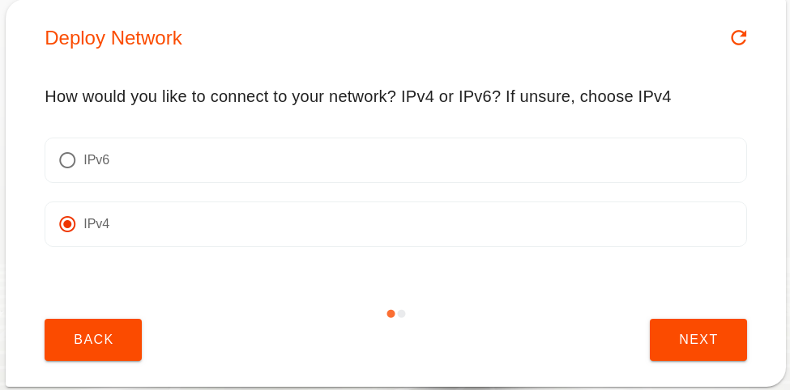

Then choose the farms on which the container can be deployed on. The farms are basically a group of nodes where multiple solutions can be deployed on. You can either choose the farm name from the drop down list or leave it empty to randomly choose any farm.

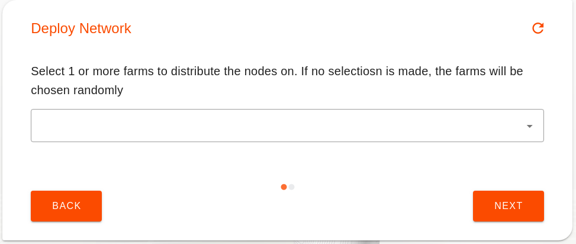

This step is there to let you configure the subnet used by your network. To make it easy here we just let the wizard pick one for us.

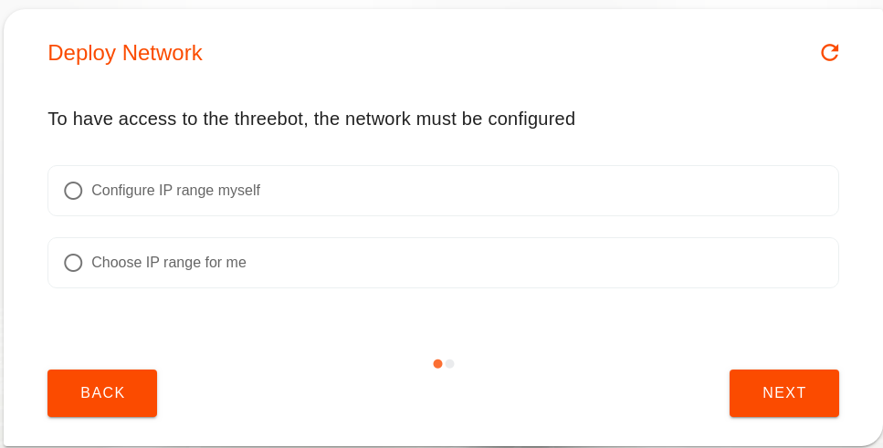

Last step shows you the configuration you need to download in order to configure your device. Just click the download button and save the configuration locally and configure you device.

Depending on your platform the configuration of Wireguard can look a bit different. But all the information required is shown in the configuration you have downloaded.

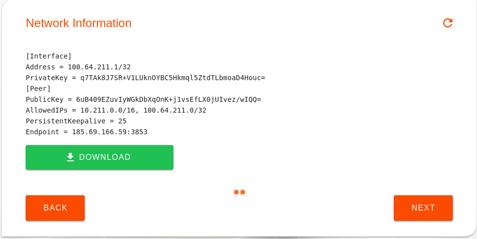


On Linux system, you can just use the `wg-quick` command directly with the file sent from the chatflow, like so:

```
wg-quick up my_first_network.conf
```

## Deploy an Ubuntu container and connect to it

Now that you have a network in place. We can deploy containers and connect it to the network. To do so we will use the Ubuntu Chat flow

To start the wizard click the left menu on Solutions then Ubuntu, then Create new


1. First step to deploy Ubuntu is to choose the network on which you want to deploy your Ubuntu container. Use the same name you entered previously when creating the network

    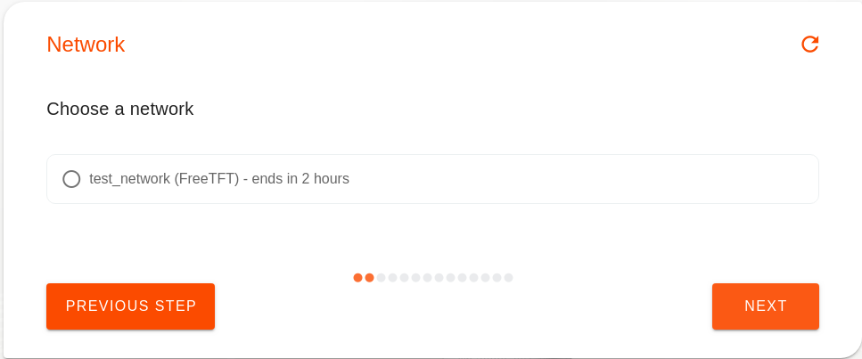

2. Second enter a name to give your Ubuntu solution. This will be used locally to save the details of the deployment.

    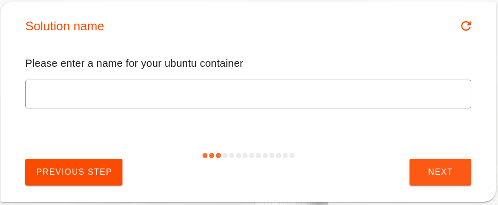

3. Next choose the version of Ubuntu on you want. We currently support versions 18.04 and 16.04
    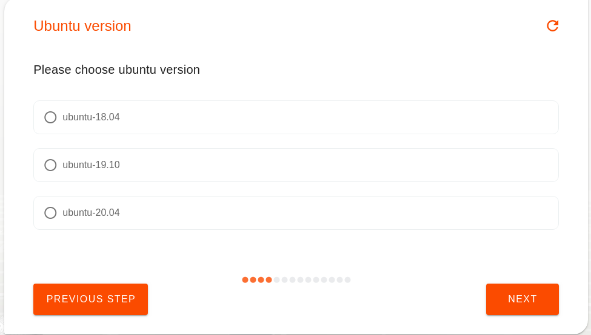

4. Then choose how much CPU and Memory resources you want allocated for the container
    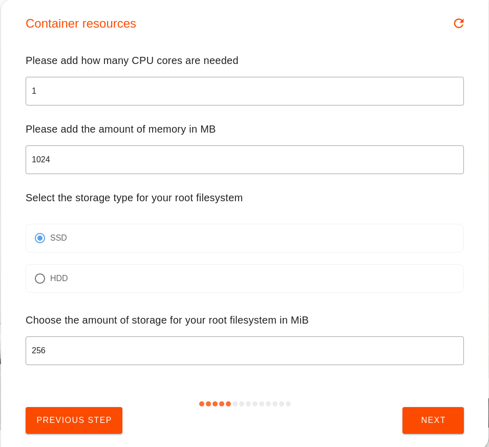

5. The next step includes the possibility to stream the container's logs to a redis channel. In our simple deployment we will not need it so you can simply choose No
    

6. In order to access this container after it is deployed, you will need to upload your public ssh key. Usually your public and private ssh key pairs are found in `~/.ssh` where the public key ends in `.pub`

    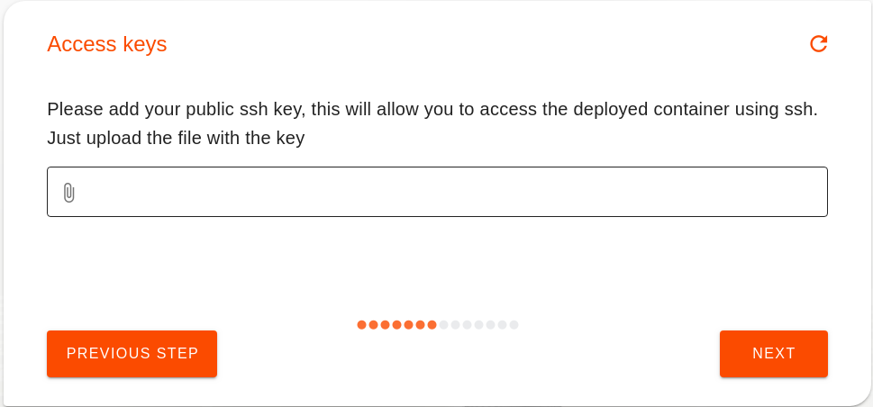

7. After that you will encounter an optional question asking for a node ID to deploy the container on. If there is a specific node you want your container to be on then provide its ID otherwise leave it empty. To discover nodes where to deploy your solution the easiest place to look for them is the explorer: https://explorer.grid.tf

    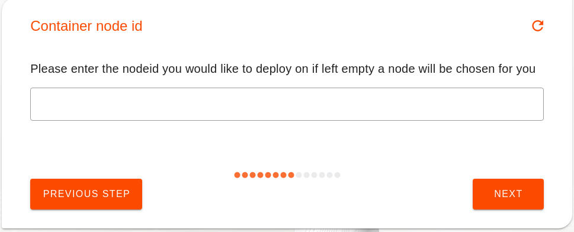

8. If you left the nodeid empty, you can then choose the farms on which the container can be deployed on. The farms are basically a group of nodes where multiple solutions can be deployed on. You can either choose the farm name from the drop down list or leave it empty to randomly choose any farm.

    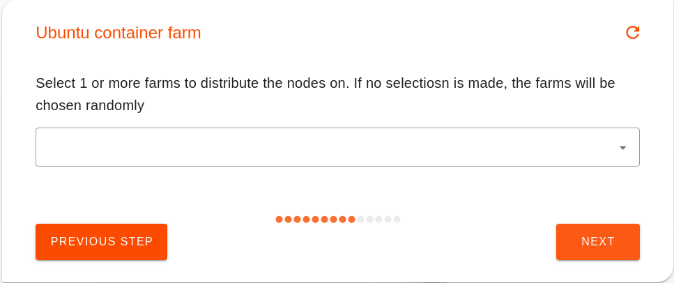

9. You can now choose an IP address that will be given to your Ubuntu container in your network. This is the IP address you will be using to access the container.

    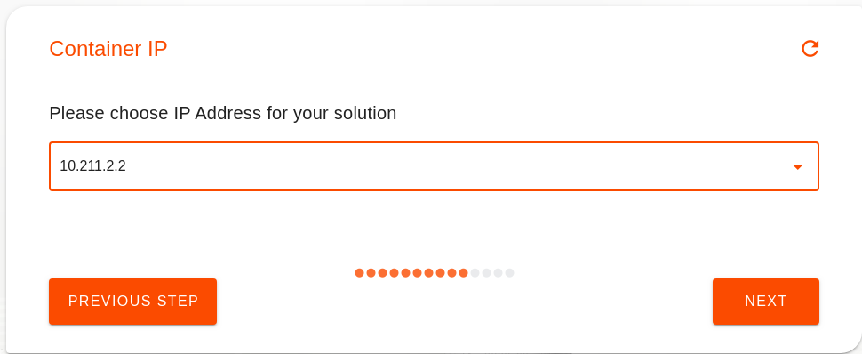

10. The next step is to choose the expiration time of your Ubuntu reservation. Each capacity reservation made on the grid is always bound to an expiration date. Once the date is reached, the capacity is released back to the grid and your workloads deleted.

    For this tutorial one day will be more than enough.

    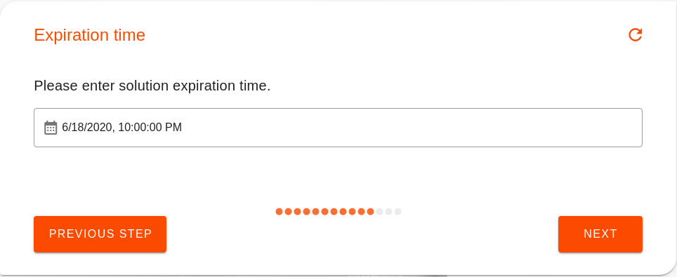

11. Then read carefully the options you selected previously until this point in the chatflow and confirm them by clicking next to proceed.

    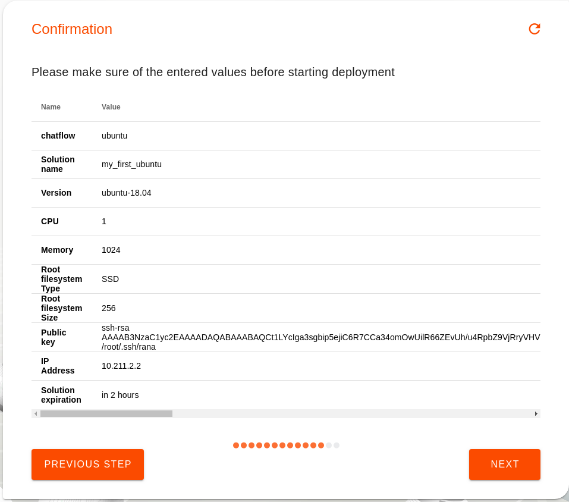

12. Now that you have chosen all the resources and details required, you will need to proceed with the payment for the solution that will be deployed. As previously mentioned, you will have your wallet setup and funded with an amount of the currency you chose your network with. The following overview will show the price of the deployment and the details regarding the address to be payed to. By clicking on the wallet you will pay with and then next then you accept the payment to be automatically done from it.

    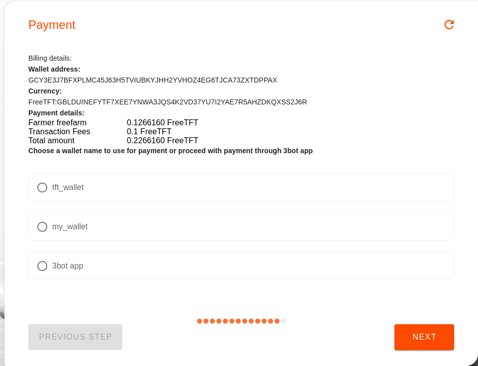

13. Once the amount is available in the wallet and the payment is successfully completed, the deployment process is continued. After the deployment is successful which may take a couple of minutes sometimes, the following message is shown with details regarding the reservation id which is a unique id used for your specific container deployment. It also views the IP address that is to be used to connect to the container.

    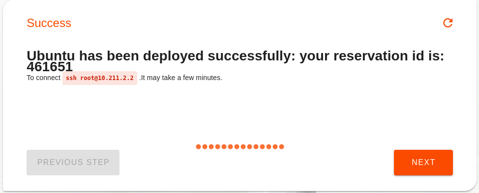

14. You can now simply access the deployed Ubuntu container by the following command

    ```bash
    ssh root@IP_ADDRESS
    ```

    where the IP address is the one you chose in the chatflow earlier and is shown in the previous success message.
