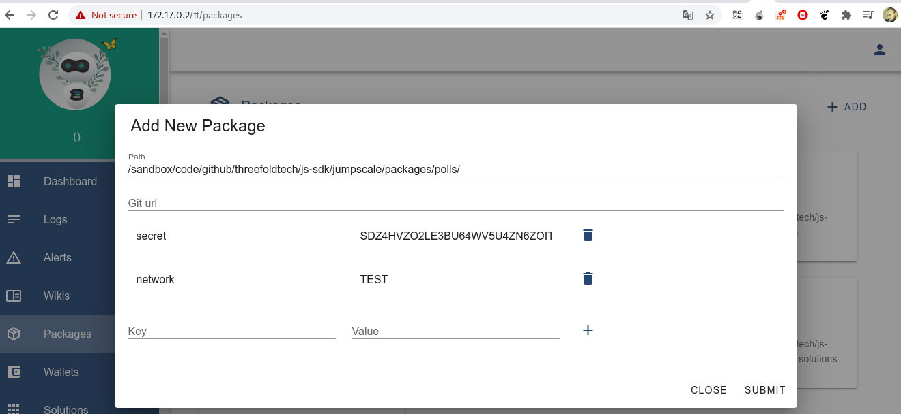

# Installing polls package
## you can install it from admin portal like the following
## click `packages` in side bar and then click on `Add`
## add the package `path` or `giturl` and if you already have a wallet add its `secret` and `network` like the following

## don't forget to click (`+`) after adding each key
## if you don't have a wallet just fill the `network` and the package will create it for you